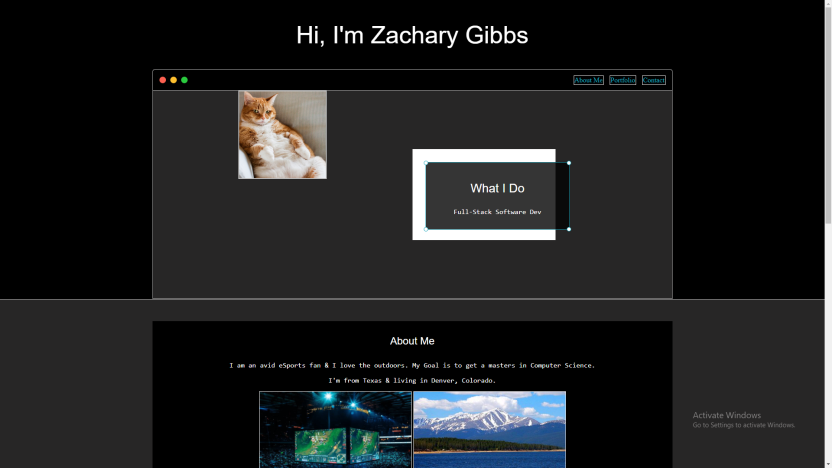
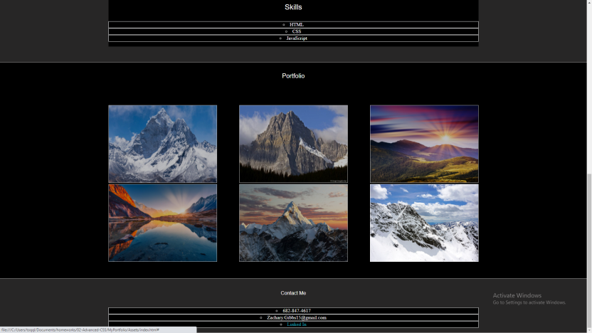

# For this project I created a portfolio of myself.
 
# Using flex-box & media queries, we have a resposive layout for future employers to see my website. 

# Created a portfolio to resemble an active website. 

# Using flex-box we created an about me sections with pictures in a row. 

# Created grids to layout our portfolio, and boxes to highlight our important information. 

# We created links in the navigation bar to send users to what they would like to see. 

# Link to the website!

https://zgibbs97.github.io/MyPortfolio/